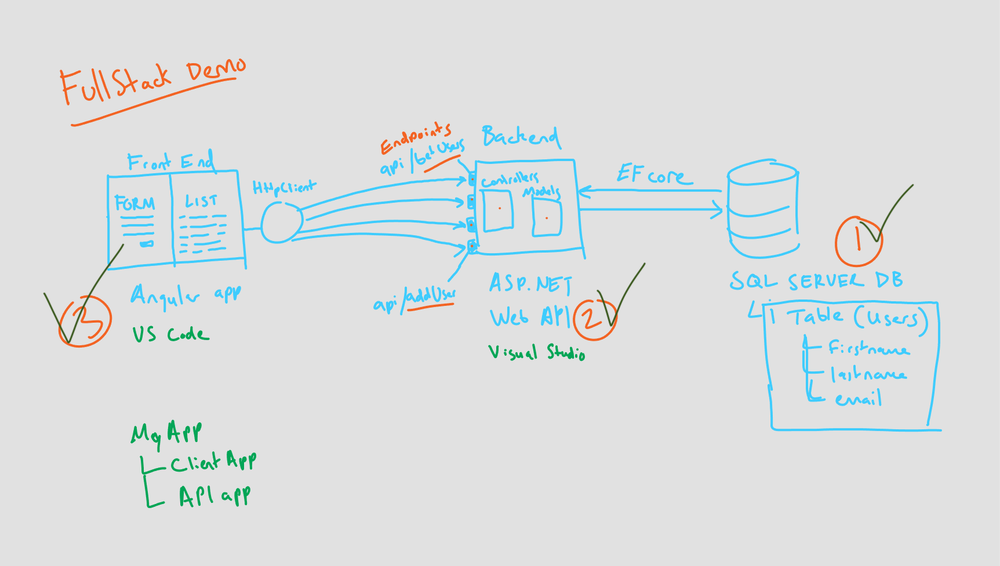

# Full Stack Demo

## Secret class recording link!

Download video here: https://drive.google.com/file/d/1D386wMBjvln-NDpyC1-aVjXktWQ0AL1F/view?usp=sharing
(Please do not share!)

## What? 

A full stack demo built with the following tech:
- Angular
- ASP.NET Web API
- SQL Server

It is a very simple application that contains a manageable list of "users" in a database. Each user is comprised of a first name, last name, and email address. The goal is to build a web site that simply displays the list of users, as well as allow the creation, editing, and deletion of users in the database.

## Why?

The intention of this demo is to help you see the 'big picture' of our tech stack. It is key to understand that we have two separate applications:
1. Front end application (built with Angular)
2. Back end application (built with .NET Web API)

In addition, it is key to understand that **data** is at the heart of our full stack application. The data (in this case, a list of "users") is what we are defining our project around.

Why are we building a **back end**? We want to build a tool that allows an easy and systematic way for *other applications* to access the "user" data that exists in our database. (We are concerned ONLY with the data itself. We have no interest in presentation or visual design - that is the responsibility of the front end.) And why is that useful? It decouples our presentation of the data away from the data. We can then access that data from a variety of front ends, like a website, a mobile app, a desktop app, a videogame, whatever!

Why are we building a **front end**? We want to build a tool (in the form of a website) that allows an easy way for *people* to access the "user" data that exists in our database. With the front end application, we simply want a way for the visitor of our website to see our data, and interact with our data.

- - - - - 

### Simplified steps
1. Create SQL Server database.
2. Create ASP.NET Web API application. (back end!)
    - Use Entity Framework Core to scaffold models for you based on the SQL database. 
    - Create Controllers to define the endpoints your front end will consume/use.
3. Create Angular application. (front end!)
    - Create a service that will to consome the API using HttpClient.

